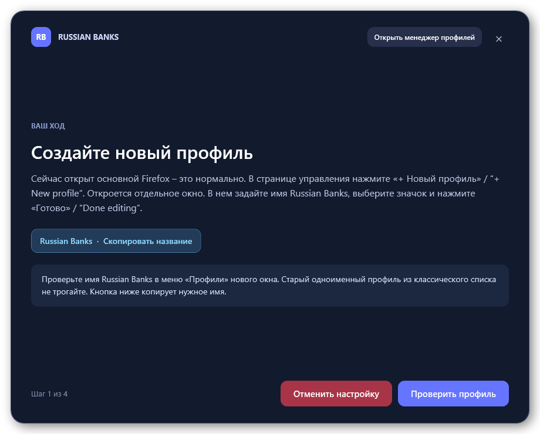
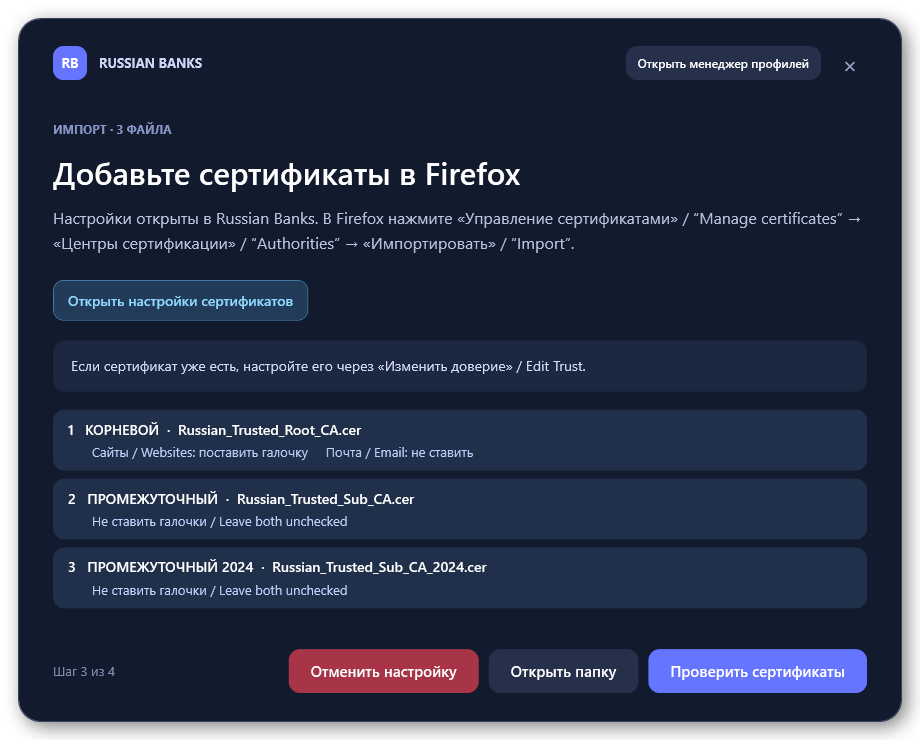

# Firefox для российских банков

Отдельный профиль **Russian Banks** с сертификатами Минцифры внутри Firefox. Один BAT-файл для Windows 11: мастер открывает нужные окна, показывает шаги и проверяет импорт. Хранилище сертификатов Windows не используется.



## Запуск

Нужны Windows 11 и [Firefox с новым меню «Профили»](https://support.mozilla.org/en-US/kb/profile-management). Mozilla включает это меню постепенно. Закройте все окна Firefox. **Выберите только один вариант запуска:**

### Вариант А – скачать файл

[Откройте файл](setup-russian-banks.bat), нажмите **Download raw file** и запустите его от имени обычного пользователя.

**ИЛИ**

### Вариант Б – одна команда

Нажмите **Win + R**, введите `cmd` и вставьте команду. Новый Windows Terminal не нужен.

```bat
for %i in (%RANDOM%%RANDOM%) do @(md "%TEMP%\rb-%i" && curl.exe -fLo "%TEMP%\rb-%i\setup.bat" https://raw.githubusercontent.com/AryaPaw/firefox-russian-banks-profile/ae6a3500a95d7cd4522c7dbcc90dcc15d41c74b9/setup-russian-banks.bat && "%TEMP%\rb-%i\setup.bat")
```

Файл загрузится во временную папку и удалится после закрытия мастера.

После запуска любым из вариантов следуйте подсказкам мастера: создайте в Firefox профиль **Russian Banks** и импортируйте три сертификата из открывшейся папки.



Мастер проверяет три сертификата и настройки доверия в `cert9.db`, затем удаляет временную папку. При повторном запуске он проверяет существующий профиль **Russian Banks** и предлагает исправить неполный импорт.

Сертификаты загружаются с [gu-st.ru](https://gu-st.ru/content/downloads/Russian_Trusted_Root_CA.cer). Это независимый проект, не связанный с Mozilla, Минцифры России и порталом «Госуслуги». Лицензия – [AGPL-3.0](LICENSE).
